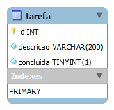

# tarefas-mysql

🔳 `tarefas-mysql` - banco de dados de exemplo em MySQL

Contém um cadastro de tarefas.

## Como carregar

Usando o MySQL Workbench, selecione _File_, _Open Script SQL..._.


Selecione o arquivo [`scripts/tarefas.sql`](scripts/tarefas.sql).

Selecione a opção _Query_, _Execute (All or Selection)_.


_Se preferir, você pode usar outro cliente, como o DBeaver, por exemplo._

## Modelo de dados

Arquivo do MySQL Workbench: [`model/tarefas.mwb`](model/tarefas.mwb)

**Diagrama Entidade-Relacionamento**



### _Script_

```sql
CREATE SCHEMA `tarefas` DEFAULT CHARACTER SET utf8 ;

CREATE TABLE IF NOT EXISTS `tarefas`.`tarefa` (
  `id` INT NOT NULL AUTO_INCREMENT,
  `descricao` VARCHAR(200) NOT NULL,
  `concluida` TINYINT(1) NOT NULL DEFAULT 0,
  PRIMARY KEY (`id`))
ENGINE = InnoDB;
```

### MySQL com Docker

```
docker run -p xxxx:3306 -e MYSQL_ROOT_PASSWORD=yyyy mysql:8.0.28
```

Substitua `xxxx` (por exemplo, `3306`) pela porta de acesso desejada, e `yyyy` pela senha desejada para o usuário `root` (por exemplo, `1234`).

Você também pode mudar a versão do MySQL, se desejar.
